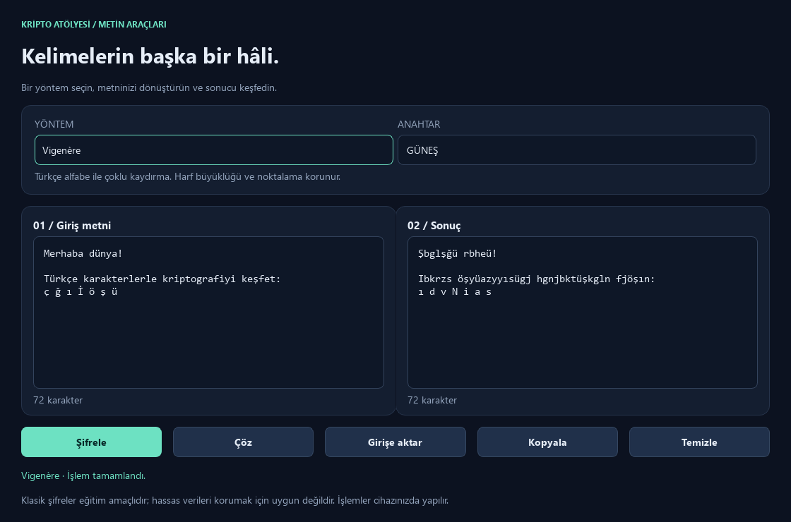

# Kripto Atölyesi

Türkçe arayüzlü, PyQt6 ile geliştirilmiş bir masaüstü kriptografi uygulaması. Klasik şifreleme yöntemlerini deneyin, metinleri Base64 ile kodlayın veya SHA-256 özetlerini oluşturun. Tüm dönüşümler cihazınızda yapılır.



## Özellikler

- Modern koyu tema ve boyutlandırılabilir giriş / sonuç panelleri.
- Türkçe alfabe desteği, karakter sayaçları ve yönteme özel anahtar alanları.
- Sonucu kopyalama, girişe aktarma ve alanları temizleme.
- `Ctrl+Enter` ile hızlı dönüşüm ve açıklayıcı hata mesajları.

## Yöntemler

| Yöntem | Anahtar | İşlev |
| --- | --- | --- |
| Sezar | Tam sayı | Harfleri kaydırır; eski sürümün 58 karakterlik küçük + büyük harf sırasını korur. |
| Vigenère | Türkçe harflerden oluşan sözcük | Çoklu kaydırma yapar; harf büyüklüğünü korur. |
| Atbash | Gerekmez | Türkçe alfabeyi ters eşler; aynı işlemle geri çözülür. |
| Raylı Çit | 2–100 arasında ray sayısı | Karakterleri zikzak sırasına göre yeniden düzenler. |
| Base64 | Gerekmez | UTF-8 metni kodlar veya kodlanmış metni çözer. |
| SHA-256 | Gerekmez | 64 onaltılık karakterden oluşan tek yönlü özet üretir. |

Sezar, Vigenère ve Atbash Türkçe alfabe dışındaki karakterleri değiştirmez. Vigenère anahtarında boşluk, rakam ve Türkçe alfabe dışındaki harfler kabul edilmez.

**Kullanım amacı:** Klasik şifreler eğitim içindir; hassas verileri korumaya uygun değildir. Base64 şifreleme değildir. SHA-256 geri çözülemez; uygulama parola saklama sistemi olarak tasarlanmamıştır.

## Kurulum

Python 3.10 veya üzeri gerekir. Uygulama Python 3.12 ve Windows 11 üzerinde test edilmiştir. Depoyu indirin veya klonlayın, ardından proje klasöründe terminal açın.

### Windows (PowerShell)

```powershell
py -m venv .venv
.\.venv\Scripts\python.exe -m pip install -r requirements.txt
.\.venv\Scripts\python.exe kriptoloji.py
```

### macOS / Linux

```bash
python3 -m venv .venv
.venv/bin/python -m pip install -r requirements.txt
.venv/bin/python kriptoloji.py
```

macOS ve Linux üzerinde ayrıca doğrulama yapılmamıştır. Linux'ta Qt için masaüstü ortamına uygun sistem kütüphaneleri gerekebilir.

## Kullanım

1. Yöntemi seçin ve metni giriş alanına yazın.
2. Yöntem gerektiriyorsa anahtarı girin.
3. **Şifrele / Çöz**, **Kodla / Kod çöz** veya **Özet oluştur** düğmesine basın.
4. **Kopyala** ile sonucu panoya alın. Tekrar işlemek için **Girişe aktar** düğmesini kullanın.

Yöntem değiştirildiğinde anahtar ve önceki sonuç temizlenir; giriş metni korunur. **Temizle** tüm metin alanlarını boşaltır.

## Testler

Kurulumun ardından Windows'ta:

```powershell
.\.venv\Scripts\python.exe -m unittest -v test_crypto test_ui
```

macOS / Linux'ta Python yolu olarak `.venv/bin/python` kullanın. Testler bilinen sonuçları, Türkçe metinlerin şifreleme–çözme döngülerini, hatalı girdileri ve arayüz davranışlarını kontrol eder. Arayüz testleri görünür pencere açmadan çalışır ve kalıcı görüntü dosyası bırakmaz.

## Windows EXE oluşturma

Windows üzerinde geliştirme bağımlılıklarını yükleyin ve paketleyin:

```powershell
.\.venv\Scripts\python.exe -m pip install -r requirements-dev.txt
.\.venv\Scripts\python.exe -m PyInstaller --noconfirm kriptoloji.spec
```

Çıktı `dist/kriptoloji.exe` dosyasıdır; Python kurulmadan çalıştırılabilir. Simge pakete dahil edilir. `build/` ve `dist/` yeniden üretilebilir çıktılardır ve Git tarafından yok sayılır. EXE dağıtmak isterseniz GitHub Releases bölümüne ekleyebilirsiniz.

## Proje yapısı

```text
Cryptography/
├── crypto_methods.py      # Şifreleme, kodlama ve özetleme
├── kriptoloji.py          # PyQt6 arayüzü ve başlangıç
├── kriptoloji.spec        # Windows paketleme ayarları
├── icon.ico              # Uygulama simgesi
├── requirements.txt      # Çalıştırma bağımlılıkları
├── requirements-dev.txt  # Paketleme bağımlılıkları
├── test_crypto.py        # Yöntem testleri
├── test_ui.py            # Arayüz testleri
└── docs/screenshot.png   # Arayüz önizlemesi
```

## Katkıda bulunma

Hata bildirirken işletim sistemini, Python sürümünü ve sorunu yeniden oluşturma adımlarını paylaşın. Değişiklik göndermeden önce testleri çalıştırın; yeni yöntemlere bilinen sonuç ve geri çözüm testleri ekleyin. Bildirimlerde gerçek parolalar veya hassas metinler paylaşmayın.
